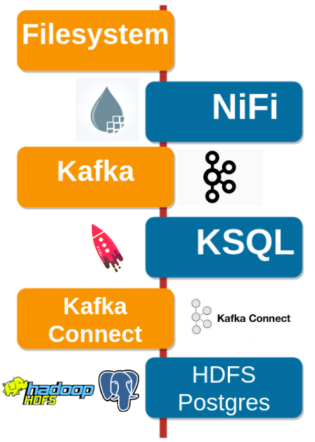

# kafka-meetup-demo

## repository for demo on second kafka meetup in bratislava
https://www.hubhub.com/events/kafka-community-meetup-bratislava-2/

Showing simple datapipeline from filesystem to target databases (Hive, Postgres) using NiFi, Kafka, KSQL and Kafka Connect with splitting files to records, conversion from json to avro and agreggation of data using KSQL streams:

### usage

- `run-env.sh` - sets up docker containers for kafka, nifi, hdfs, etc.
  - docker-compose.yml for hive - need to add export of port 8020:8020 for namenode
- `generate-payments.sh` - generate example json payments to `example.json`
- `/utils` - utils scripts for deploying connectors to kafka-connect, load of data directly to kafka and with ksql streams 
- `/connectors` - property files for 2 connectors - to hive and postgres
- `/dummy-data` - dummy-data for nifi/kafka
- `/ksql-udf-example` - example of kafka sql user defined function
- `/nifi-custom-processor` - example of nifi custom processor for faster splitting files to records and sending them to kafka 
